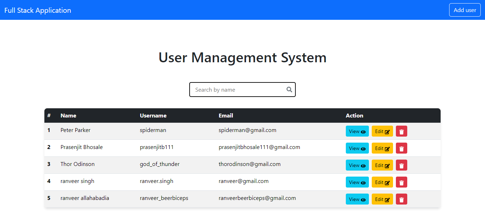

# Simple CRUD - Rest api springboot + react project - to revise concepts . 

## Overview

This project was built to learn and practice CRUD operations, REST API development, and React. It uses Spring Boot for the backend, SQL for the database, React for the frontend, and Postman for API testing.

## Features

<ul>
  <li><strong>User Management:</strong> Create, read, update, and delete tasks.</li>
  <li><strong>Validation:</strong> Ensure accurate and valid data entries.</li>
  <li><strong>Search:</strong> Seach by Name functionality </li>
</ul>

## Images

Here are some screenshots of the application:

<!-- Main Screenshot -->

## API Endpoints

<ul>
  <li><code>GET /users</code>: Retrieve all users</li>
  <li><code>POST /users</code>: Create a new user</li>
  <li><code>PUT /users/{id}</code>: Update an existing user</li>
  <li><code>DELETE /users/{id}</code>: Delete a user</li>
</ul>

<!-- Add more images as needed 
## Login

-->

